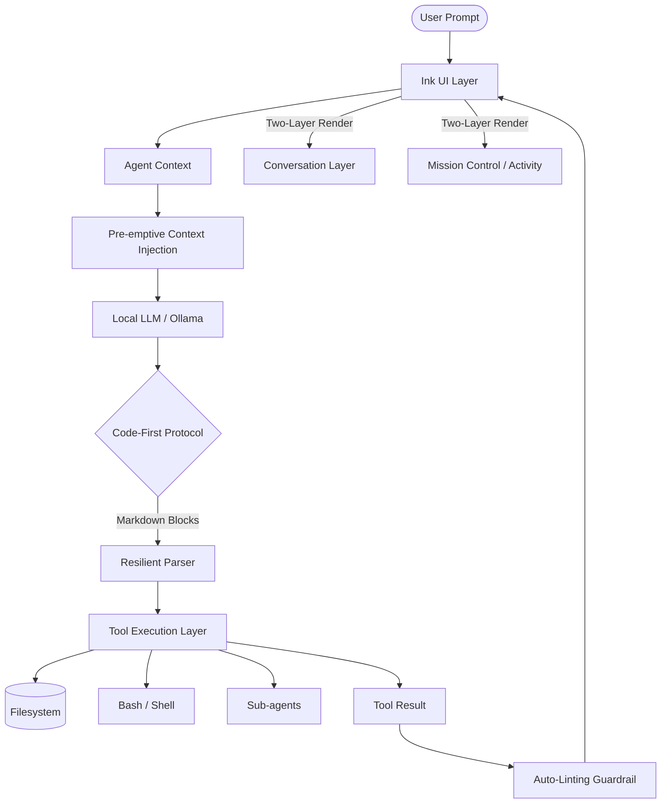

# ycode

An agentic CLI designed for local-first software engineering. It implements the "Agentic Loop" architecture—planning, executing, and verifying tasks—using open-source models (via Ollama/Groq) to provide a private, cost-free alternative to paywalled coding assistants.

## The Core Concept: The Loop
ycode operates on a continuous feedback loop:
1. **Perceive**: Receives user intent and current project context.
2. **Reason**: The LLM decides which tools are necessary (ls, cat, write, etc.).
3. **Act**: Executes the tool after user verification.
4. **Observe**: Injects the tool's output back into the conversation for the next reasoning step.

## Architecture

ycode implements a robust, two-layer architecture designed to maximize the performance of open-source models:



### Key Components:
- **Conversation Layer**: Handles natural language chat and explicit reasoning (`think` blocks).
- **Activity Layer (Mission Control)**: Persistent state for tool execution, background processes, and the active `plan`.
- **Code-First Protocol**: Uses Markdown-native code blocks for 100% reliable tool calling on smaller models.
- **Auto-Linting Guardrail**: Automatically verifies file changes by running build/test commands before final delivery.

## Technical Stack
- **Runtime**: Node.js (TypeScript)
- **Engine**: OpenAI SDK (Universal bridge for local/open endpoints)
- **Tooling**: Built-in filesystem primitives with a manual permission model.
- **Testing**: Vitest integration for behavioral evaluations (Evals).

## 🚀 Getting Started

See [GETTING_STARTED.md](./GETTING_STARTED.md) for detailed installation and setup instructions.

### Quick Start
1. `npm install`
2. `npm run build`
3. `npm start`

## ✨ New in v0.1.0: Rich CLI UI
`ycode` now features a modern, interactive CLI built with **Ink (React for CLI)**:
- **Live Streaming**: Watch assistant responses and tool outputs appear in real-time.
- **Interactive Permissions**: Approve or deny sensitive tool calls (like `bash` or `rm`) through a dedicated UI block.
- **Markdown Support**: Beautifully formatted technical explanations and code blocks.
- **Improved Reliability**: The new **Code-First Protocol** uses Markdown-native action blocks, eliminating JSON escaping errors and ensuring 100% reliable execution on local models like Qwen2.5-coder.

## Security: The Permission Model
ycode follows a **Security-First** approach. For any tool that modifies the filesystem or executes shell commands, the agent will pause and request explicit user confirmation via an interactive UI block.


## Development & Testing
Run the integration suite and behavioral evals:
```bash
npm test
```
